*[English version](INSTALL_GUIDE.md)*

# Guía de instalación (paso a paso, con capturas)

Esto explica el instalador de Windows de principio a fin, incluido el aviso de SmartScreen de
Microsoft Edge que verás porque el instalador todavía no está firmado (Early Access — ver
`docs/ROADMAP-es.md`). Las capturas de abajo son de una instalación real; la interfaz del
instalador es visualmente idéntica entre versiones, así que algunas pueden seguir mostrando un
número de versión anterior en la esquina.

## 1. Descarga

Consigue `obs-trigglow-dynamic-delay-0.3.0-windows-x64-setup.exe` desde la
[última release](https://github.com/VirosMs/obs-trigglow-dynamic-delay/releases/latest). ¿Prefieres
instalarlo a mano? El `.zip` de esa misma release solo trae los archivos del plugin — ver
"Installing the compiled plugin in OBS" en `README-es.md`.

## 2. Windows SmartScreen: por qué aparece y cómo continuar

Como el instalador no está firmado con un certificado de firma de código, Microsoft Defender
SmartScreen no puede confirmar que sea seguro y avisa antes de dejarlo ejecutar. Es normal para
software Early Access sin firmar, no una señal de que algo esté mal — pero solo deberías continuar
con instaladores de un origen en el que confíes de verdad (en este caso, la página de Releases de
GitHub enlazada arriba).

Nada más terminar la descarga, Edge muestra este aviso. Haz clic en **"Mantener de todos modos"**:

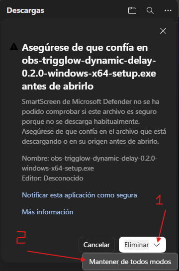

Si cerraste ese aviso, o vuelves a él más tarde desde la lista de Descargas, haz clic en el menú
**"..."** junto al archivo:

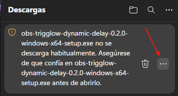

...y elige **"Conservar"**:

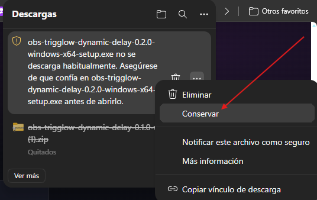

¿Usas otro navegador? El aviso y los nombres exactos de los botones serán distintos (Chrome,
Firefox), pero la decisión de fondo es la misma: confirmar que confías en el archivo antes de
abrirlo.

## 3. Cierra OBS antes de instalar

**Instálalo antes de salir en directo, no durante el stream.** El instalador necesita sobrescribir
archivos que OBS tiene abiertos mientras está en marcha — si OBS está abierto al empezar la
instalación, te ofrecerá cerrarlo automáticamente (ver el paso 4 de abajo) y volver a abrirlo al
terminar. Planea la instalación para antes de una sesión, no a mitad de una emisión.

## 4. Ejecuta el instalador

Es un asistente estándar de siguiente-siguiente-siguiente:

1. Elige un idioma:

   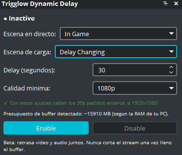

2. Pantalla de bienvenida — confirma la versión que se va a instalar (esta captura muestra la
   0.2.0; el asistente de la 0.3.0 se ve idéntico, solo con el número de versión más nuevo):

   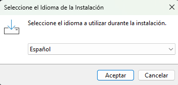

3. Carpeta de destino — detectada automáticamente a partir de tu instalación de OBS Studio (vía la
   clave del registro que escribe el propio instalador oficial de OBS); puedes elegir otra carpeta
   si hace falta:

   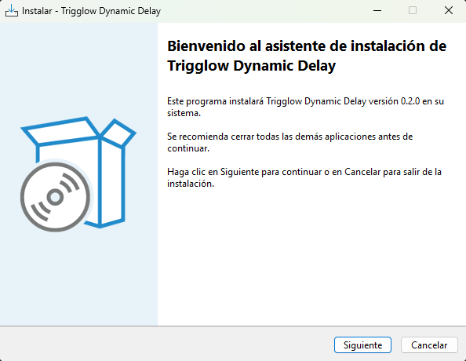

4. Si OBS sigue abierto, el instalador se ofrece a cerrarlo automáticamente:

   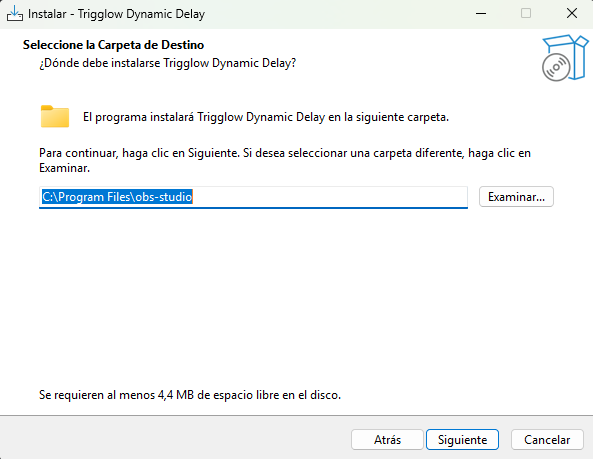

5. Instalando:

   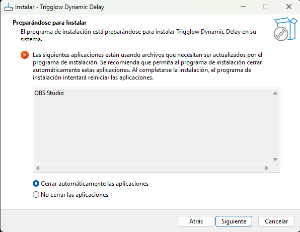

6. Listo — opcionalmente, lanza OBS Studio al momento:

   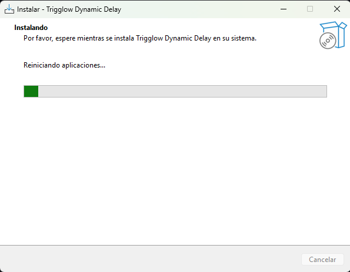

## 5. Activa el panel en OBS

El panel no siempre aparece solo la primera vez. En la barra de menú de OBS, abre
**Paneles (View → Docks)**:

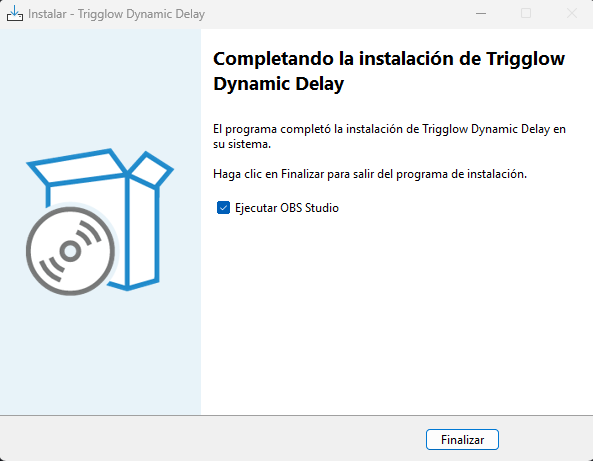

Haz clic en **"Restablecer paneles"**, o simplemente asegúrate de que **"Trigglow Dynamic Delay"**
esté marcado en ese mismo menú:

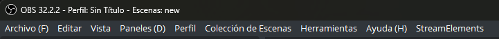

El panel aparece mostrando `● Inactive` — ya puedes elegir una escena en directo y empezar. Ver
"Using the plugin" en `README-es.md` para qué configurar a continuación.

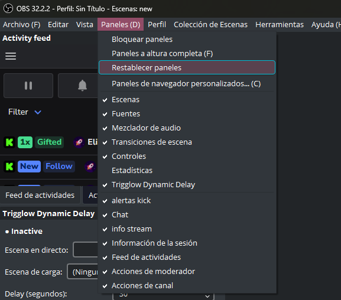
